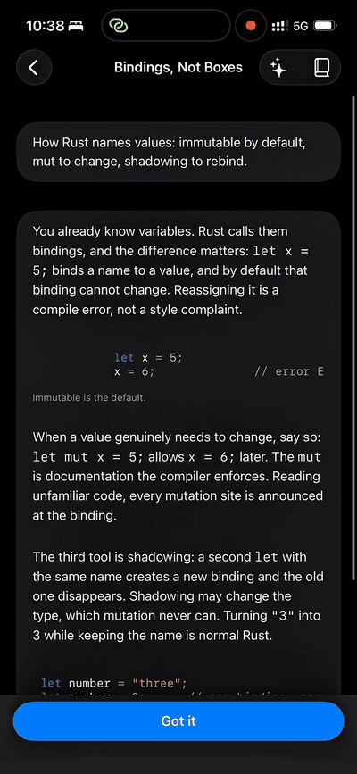
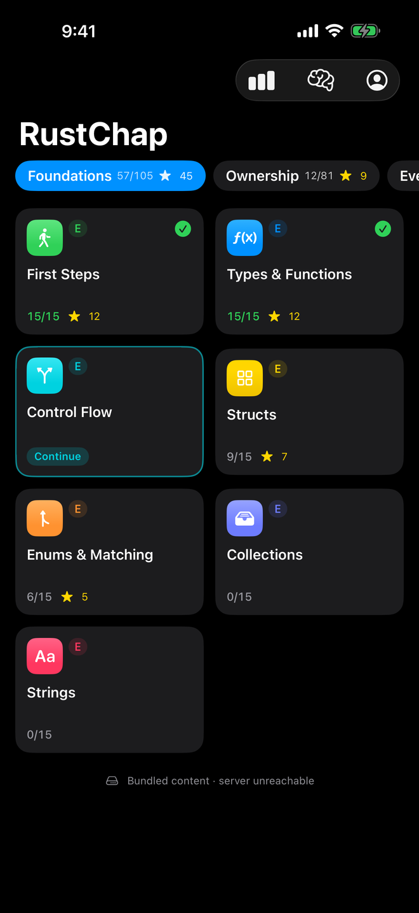
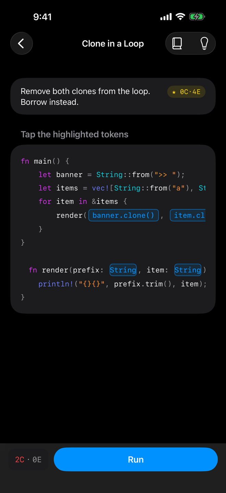
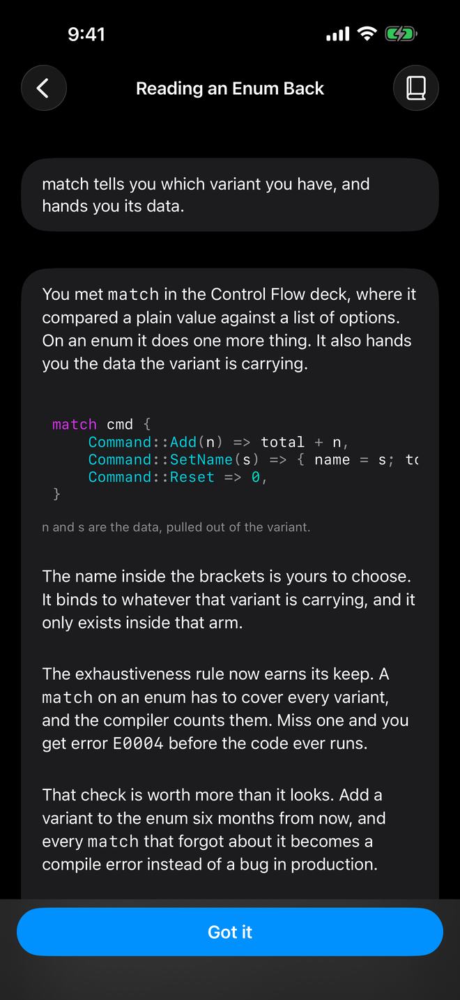
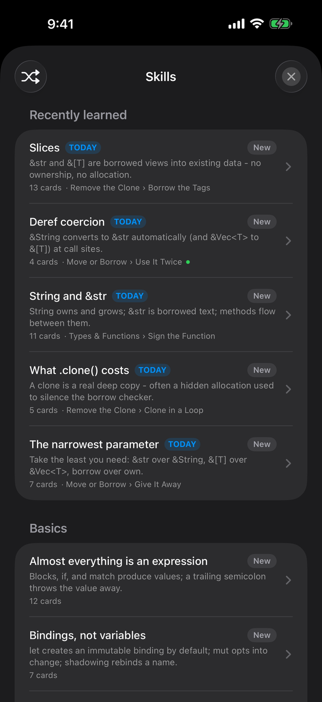

# RustChap 🦀

**Learn Rust the way Euclidea teaches geometry: small puzzles with exact answers,
verified by the real compiler.**

### ▶ [Play it now on TestFlight](https://testflight.apple.com/join/uCRCD2wq)

Free, no account, no ads. You need Apple's free
[TestFlight](https://apps.apple.com/app/testflight/id899247664) app first, then
the link above installs RustChap.

> The App Store version is *still in review*. It has been sitting in "Waiting for
> Review" since 5 August, which I'm told is a normal amount of time in the same
> way that a fortnight is a normal amount of time to wait for a bus. Stay tuned.
> Meanwhile the TestFlight link above is the whole game, today.

I'm [Uncle Code](https://unclecode.com) ([@unclecode](https://x.com/unclecode)),
author of [Crawl4AI](https://github.com/unclecode/crawl4ai)
[](https://github.com/unclecode/crawl4ai).
I planned to rewrite Crawl4AI in Rust, and that meant making Rust second nature -
not vocabulary, instinct. I'm also a long-time fan of Euclidea; I've played it
through many times. So I built the same kind of game for the thing I needed to
learn, for myself first. This is it.

RustChap is a native iOS game for experienced programmers. One tiny program per
screen, constrained edits instead of typing: tap tokens, reorder statements, pick
the best implementation. Every legal answer to every puzzle was compiled ahead of
time with real `rustc` and Clippy, so every verdict is the compiler's truth - not
my opinion.

If you're a professional programmer coming from other languages and want Rust's
idioms, syntax, and concepts to become reflexes, this is a good place. Pull
requests are welcome - puzzles, lectures, and more.

> Not "learn Rust". The promise is **develop Rust instincts**: predicting what the
> type system permits, expressing ownership correctly, recognising the idiomatic
> solution.

<p align="center">
  
</p>

<p align="center"><sub>
  <code>print_name(name)</code> moves the string, so the next line will not compile.
  Two taps make it a borrow, and the meter reaches the <code>0C·2E</code> budget.
  <a href="docs/screens/demo.mp4">Full-size video</a>
</sub></p>

<p align="center">
  
  
  
  
</p>

<p align="center"><sub>
  Six levels · a puzzle scored <code>0C·4E</code> (zero clones, four edits) ·
  a lecture that assumes you already program · the Skills list that remembers
  what you learned
</sub></p>

## What's in it

**477 nodes across 31 decks, in six levels.** 3,160 answers precompiled and
verified, so scoring works offline and instantly.

| Level | Decks |
| --- | --- |
| **Foundations** | First Steps · Types & Functions · Control Flow · Structs · Enums & Matching · Collections · Strings |
| **Ownership** | Move or Borrow · Remove the Clone · Slices & Views · Repair the Lifetime · Drop & Cleanup |
| **Everyday Rust** | Option & Result · Pattern Matching · Build the Iterator · Errors That Travel · Modules & Visibility · Standard Traits |
| **Abstraction** | Closures · Traits & Bounds · Generics vs dyn · Design the API |
| **Systems** | Smart Pointers · Interior Mutability · Threads & Channels · Async & Send · Unsafe Rust |
| **Mastery** | Idiomatic Patterns · Testing · Atomics & Ordering · FFI & Raw Pointers |

Every level is free to enter. Decks unlock in order within a level, so you can
start at Systems on day one if that's where your gap is.

## How it plays

- **335 puzzles**, each teaching exactly one instinct. Ranks are mechanical:
  Solved (compiles, tests pass) → Fluent → Optimal (match the star budget, like
  `0C·2E` - zero clones in two edits).
- **142 short lectures** in plain English. One idea each, anchored to a language
  you already know: "You will recognise the shape from `switch` in C, Java, or
  JavaScript, but three things are different."
- **528 review cards over 64 concepts.** Solve a puzzle and its concepts join
  your Skills list, where you review them later - rules, syntax, and the gotchas
  that catch people coming from other languages. Group by topic or shuffle
  everything.
- **A grounded AI tutor** that can see the puzzle on your screen. On-device by
  default (Apple Foundation Models); optionally bring your own OpenRouter key.
- **Fully offline.** No account, no ads, no tracking, no server.

## How it works

The puzzle JSON contract lives in [`schemas/`](schemas/) and is enforced by
[`crates/puzzle-schema`](crates/puzzle-schema). [`crates/evaluator`](crates/evaluator)
compiles every enumerated submission with the pinned toolchain; the
[`puzzle-linter`](tools/puzzle-linter) writes the verdicts into `outcomes/`
sidecars the app bundles. The iOS app ([`apps/ios`](apps/ios)) looks answers up
by a canonical operations hash - byte-identical between Rust and Swift. That's
why the app can be offline and instant: tapping Run is a dictionary lookup, not a
compile. CI recompiles every submission on each push and fails if any verdict
drifts.

```text
apps/ios/                  SwiftUI iPhone app (Swift 6)
crates/puzzle-schema/      Puzzle JSON contract: types, validation, hashing
crates/evaluator/          Ops → source → rustc/clippy → verdict + metrics
services/api/              Axum API (built and tested; not deployed - v0.1 is serverless)
content/packs/             31 decks: puzzles, lectures, verified outcomes
content/concepts/          The tap-to-learn skill library
content/review/            Review cards for the Skills screen
schemas/                   The platform-neutral JSON contract
tools/                     Linter, deck authoring, progression audit, release
docs/context/              Living design fragments (start at its README)
```

## Building

```sh
cargo test --workspace                             # engine + contract tests
cargo run -p puzzle-linter -- --check \
  --concepts content/concepts content/packs/*/     # re-verify every answer
python3 tools/audit-progression.py                 # curriculum audit
python3 tools/check-style.py                       # writing-voice check
# iOS app (requires Xcode):
xcodebuild -project apps/ios/RustChap.xcodeproj -target RustChap \
  -configuration Debug -sdk iphonesimulator build
```

## Contributing

Issues and pull requests are welcome - especially new puzzles and lectures.

A puzzle must have **exactly one optimal answer**, and every wrong choice must
fail for a reason worth learning. The linter recompiles every combination and
enforces that; the progression audit and the writing-voice check run in CI too.
The quality bar and the house style live in
[`docs/context/foundation/curriculum.md`](docs/context/foundation/curriculum.md).
Every node carries a `source` attribution.

Content sources: [rustlings](https://github.com/rust-lang/rustlings) and
[Exercism](https://github.com/exercism/rust) (MIT) for exercises, and
[Comprehensive Rust](https://github.com/google/comprehensive-rust) (CC-BY-4.0
prose, Apache-2.0 code) for the teaching sequence and voice. RustChap is not
affiliated with or endorsed by Google or the Rust project.

In Claude Code, `/rustchap-context` loads the right design fragment for whatever
you touch.

## License

Apache License 2.0 with the [Commons Clause](https://commonsclause.com)
condition: use, modify, and build RustChap for yourself, and contribute back -
but do not sell it or a product substantially derived from it. See
[LICENSE](LICENSE).

RustChap is an independent educational project, not affiliated with or endorsed
by the Rust Foundation. Ferris artwork by Karen Rustad Tölva (CC0).
